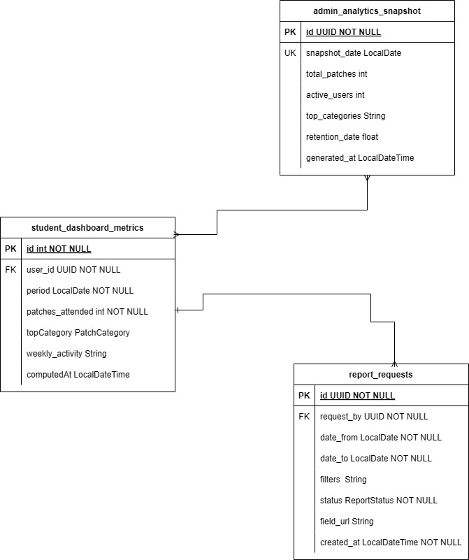
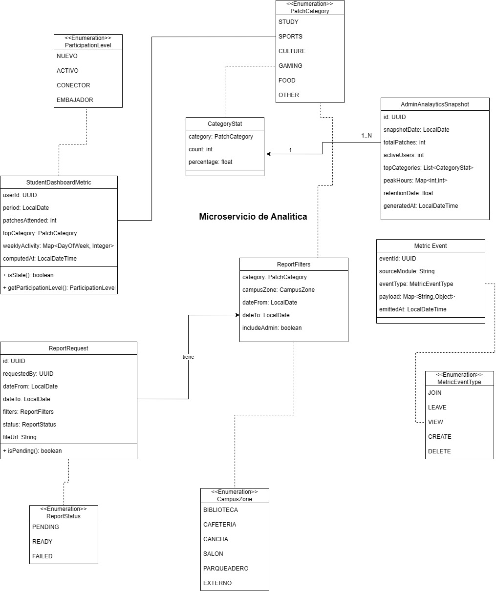
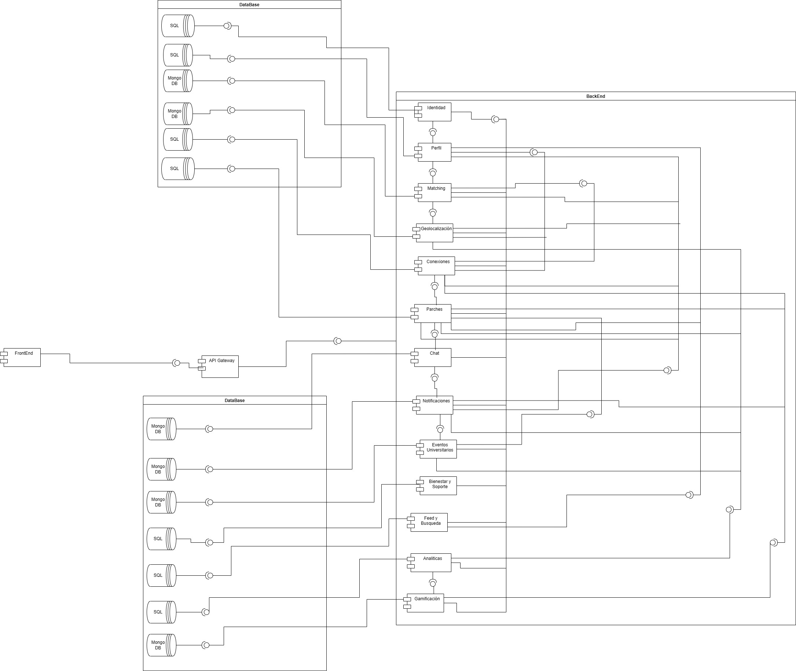

<div align="center">

# Mewtwo-Code — Microservicio de Estadísticas y Analítica (M12)

### *"Momentos que inspiran, parches que unen."*

---

### Stack Tecnológico


### Infraestructura & Calidad


### Arquitectura


</div>

---

## Tabla de Contenidos

1. [Integrantes](#1-integrantes)
2. [Tecnologías Utilizadas](#2-tecnologías-utilizadas)
3. [Descripción del Microservicio](#3-descripción-del-microservicio)
4. [Cómo Funciona](#4-cómo-funciona)
5. [Diagrama de Datos](#5-diagrama-de-datos)
6. [Diagrama de Clases](#6-diagrama-de-clases)
7. [Diagrama de Componentes](#7-diagrama-de-componentes)
8. [Funcionalidades Principales](#8-funcionalidades-principales)
9. [Endpoints](#9-endpoints)
10. [Colas de Mensajería](#10-colas-de-mensajería)
11. [Evidencia de Pruebas](#11-evidencia-de-pruebas)
12. [Evidencia de Cobertura](#12-evidencia-de-cobertura)
13. [Cómo Ejecutar](#13-cómo-ejecutar)
14. [Evidencia CI/CD](#14-evidencia-cicd)
15. [Link Swagger](#15-link-swagger)
16. [Estructura del Código](#16-estructura-del-código)
17. [Código Documentado](#17-código-documentado)
18. [Conexiones Externas](#18-conexiones-externas)
19. [Pipeline de Desarrollo](#19-pipeline-de-desarrollo)
20. [Pipeline de Producción](#20-pipeline-de-producción)
21. [Dockerizado](#21-dockerizado)
22. [Versionamiento](#22-versionamiento)

---

## 1. Integrantes

- Juan Esteban Rodriguez
- Fabian Andrade
- Diego Rozo
- Juan David Gomez
- Adrian Ducuara

---

## 2. Tecnologías Utilizadas

| **Tecnología / Herramienta** | **Uso principal en el proyecto** |
|---|---|
| **Java 21 (OpenJDK)** | Lenguaje base del módulo con soporte para Spring Boot. LTS hasta 2029. |
| **Spring Boot 3.3.0** | Framework principal. Agrupa JPA, Security, Kafka y Swagger en un solo ecosistema. |
| **Spring Web** | Exposición de 4 endpoints REST del módulo (dashboard, admin, solicitar reporte, descargar reporte). |
| **Spring Security + OAuth2 Resource Server** | Protección de endpoints mediante JWT. Extrae `userId` del claim `sub` y rol del claim `role`/`roles`. |
| **Spring Data JPA** | Acceso a PostgreSQL con mapeo objeto-relacional para las 3 entidades del módulo. |
| **PostgreSQL 16** | BD relacional principal — tablas `student_dashboard_metrics`, `admin_analytics_snapshot`, `report_requests`. |
| **Apache Kafka (Confluent 7.6.0)** | Consumo de eventos `MetricEvent` publicados por M02, M03 y M06. Consumer group: `m12-analytics-group`. |
| **OpenCSV 5.9** | Generación de archivos CSV para reportes exportables. |
| **Apache Maven** | Gestión de dependencias y automatización de builds. |
| **Lombok** | Reducción de boilerplate con `@Builder`, `@Getter`, `@Value`, `@RequiredArgsConstructor`. |
| **H2 (in-memory, modo PostgreSQL)** | BD embebida para perfil `dev`. No requiere Docker. |
| **JUnit 5** | Framework de pruebas unitarias. |
| **Mockito** | Simulación de puertos y repositorios en pruebas sin infraestructura real. |
| **JaCoCo 0.8.12** | Cobertura de pruebas integrada al pipeline CI. |
| **SpringDoc OpenAPI 2.5.0** | Swagger UI en `/swagger-ui.html`. OpenAPI 3 desde anotaciones. |
| **Docker** | Contenedorización. Build multi-etapa con `eclipse-temurin:21-jre-alpine`. |
| **GitHub Actions** | CI: compile → test (JaCoCo) → upload coverage → docker build. |

---

## 3. Descripción del Microservicio

El microservicio de **Estadísticas y Analítica** (M12) provee visibilidad cuantitativa sobre la actividad del campus de la plataforma PATRIC.IA. Funciona como un microservicio autónomo que:

- Expone un **dashboard personal** al estudiante con métricas de participación (parches asistidos, categoría favorita, actividad semanal y nivel de participación calculado).
- Expone un **panel administrativo** con métricas agregadas de la plataforma, filtrable por rango de fechas y tipo de métrica.
- Permite **generación asíncrona de reportes CSV** con filtros por categoría, zona y rango de fechas.
- **Consume eventos Kafka** publicados por M02, M03 y M06 para actualizar métricas en tiempo real sin acoplamiento HTTP.

Puerto: `8084`. Sin Redis. No publica eventos Kafka (solo consume).

---

## 4. Cómo Funciona

### Arquitectura Hexagonal (Ports & Adapters)

El módulo implementa arquitectura hexagonal. El dominio es completamente independiente de frameworks. Los controladores REST y los repositorios JPA son adaptadores externos que implementan puertos (interfaces).

```
┌─────────────────────────────────────────────────────┐
│                  EXTERIOR                           │
│  ┌──────────────┐         ┌──────────────────────┐  │
│  │  Controllers │         │  JPA Adapters        │  │
│  │  (REST)      │         │  Kafka Consumer      │  │
│  │  Port In ──► │         │  CsvGenerator        │  │
│  └──────┬───────┘         └────────────┬─────────┘  │
│         │          DOMINIO             │ ◄ Port Out  │
│         ▼   ┌────────────────────┐    │             │
│         └──►│  Application       │◄───┘             │
│             │  Services          │                   │
│             └────────────────────┘                   │
└─────────────────────────────────────────────────────┘
```

**Flujo de dependencias:** `Entrypoints / Infrastructure → Application → Domain`

### Patrones de Diseño

| Patrón | Ubicación | Descripción |
|---|---|---|
| **Ports & Adapters** | Toda la arquitectura | 4 puertos de entrada (use cases) + 4 de salida (repos + CSV). |
| **Builder** | Todos los modelos y DTOs | Lombok `@Builder` en todas las entidades de dominio y respuestas. |
| **Value Object** | `ReportFilters`, `CategoryStat` | Clases `@Value` inmutables. Igualdad por atributos. |
| **Adapter (GoF)** | `CsvGeneratorAdapter` | Adapta OpenCSV al puerto `CsvGeneratorPort` del dominio. |
| **Empty Object Pattern** | `DashboardService.buildEmptyMetric()` | Retorna métrica vacía (days=0, level=NUEVO) en vez de 404 cuando el usuario no tiene datos. |
| **Async/Command** | `ReportService.generateAsync()` | `@Async` retorna 202 inmediatamente; CSV se genera en hilo separado. |
| **Semester Range Strategy** | `AdminAnalyticsService.activeSemester()` | Calcula dinámicamente el semestre activo: Ene–Jun o Jul–Dic. |
| **Mapper** | `infrastructure/adapters/persistence/mapper/` | Conversión bidireccional entidad JPA ↔ dominio. Serializa `weeklyActivity` (Map→JSON) con `ObjectMapper`. |

### Conexión con Otros Módulos

| Módulo | Protocolo | Dirección | Dato |
|---|---|---|---|
| M01 — Autenticación | JWT (validación local) | M01 → M12 | M12 valida el JWT de M01 localmente. Extrae `userId` del claim `sub`. |
| M02 — Parches | Kafka (eventos) | M02 → Kafka → M12 | Eventos `CREATE`/`DELETE` → actualiza `admin_analytics_snapshot`. |
| M03 — Usuarios | Kafka (eventos) | M03 → Kafka → M12 | Eventos de actividad → actualiza `student_dashboard_metrics`. |
| M06 — Feed & Búsqueda | Kafka (eventos) | M06 → Kafka → M12 | Eventos `JOIN`/`LEAVE`/`VIEW` → actualiza `patchesAttended`, `topCategory`, `weeklyActivity`. |

---

## 5. Diagrama de Datos

<div align="center">

</div>

### Tabla: `student_dashboard_metrics`

| Campo | Tipo | Descripción | Restricciones |
|---|---|---|---|
| **id** | `UUID` | Identificador único | PK |
| **user_id** | `UUID` | ID del estudiante (referencia a M03) | NOT NULL |
| **period** | `DATE` | Período de las métricas | NOT NULL |
| **patches_attended** | `INT` | Total de parches asistidos | NOT NULL |
| **top_category** | `VARCHAR(50)` | Categoría con mayor participación | Nullable |
| **weekly_activity** | `TEXT` | Map JSON `{MONDAY:2, TUESDAY:0, ...}` | Nullable |
| **computed_at** | `TIMESTAMP` | Timestamp del último cálculo. Stale si > 5 min. | NOT NULL |

### Tabla: `admin_analytics_snapshot`

| Campo | Tipo | Descripción | Restricciones |
|---|---|---|---|
| **id** | `UUID` | Identificador único | PK |
| **snapshot_date** | `DATE` | Fecha del snapshot diario | NOT NULL, UNIQUE |
| **total_patches** | `INT` | Total de parches en el sistema | NOT NULL |
| **active_users** | `INT` | Usuarios únicos con actividad | NOT NULL |
| **top_categories** | `TEXT` | Lista JSON `[{category, count, percentage}]` | Nullable |
| **retention_rate** | `FLOAT` | Tasa de retención (0.0–1.0) | NOT NULL |
| **generated_at** | `TIMESTAMP` | Timestamp de generación | NOT NULL |

### Tabla: `report_requests`

| Campo | Tipo | Descripción | Restricciones |
|---|---|---|---|
| **id** | `UUID` | Identificador único | PK |
| **requested_by** | `UUID` | ID del solicitante | NOT NULL |
| **date_from** | `DATE` | Inicio del rango | NOT NULL |
| **date_to** | `DATE` | Fin del rango | NOT NULL |
| **filters** | `TEXT` | `ReportFilters` serializado como JSON | Nullable |
| **status** | `VARCHAR(20)` | `PENDING`, `READY`, `FAILED` | NOT NULL |
| **file_url** | `VARCHAR` | Ruta absoluta del CSV generado | Nullable |
| **created_at** | `TIMESTAMP` | Fecha de creación | NOT NULL |

---

## 6. Diagrama de Clases

<div align="center">

</div>

**Resumen del diseño de dominio:**

- **`StudentDashboardMetric`** — entidad central con `userId`, `period`, `patchesAttended`, `topCategory`, `weeklyActivity`, `computedAt`. Métodos: `isStale()` (stale si > 5 min) y `getParticipationLevel()`.
- **`AdminAnalyticsSnapshot`** — snapshot diario con `snapshotDate`, `totalPatches`, `activeUsers`, `topCategories`, `retentionRate`, `generatedAt`.
- **`ReportRequest`** — solicitud de CSV con `requestedBy`, `dateFrom`, `dateTo`, `filters`, `status` (PENDING/READY/FAILED), `fileUrl`.
- **`ReportFilters`** — value object inmutable: `category`, `campusZone`, `dateFrom`, `dateTo`, `includeAdmin`.
- **`CategoryStat`** — value object: `category`, `count`, `percentage`.
- **`MetricEvent`** — DTO de Kafka sin persistencia JPA: `eventId`, `sourceModule`, `eventType`, `payload`, `emittedAt`.

Enumeraciones: `ParticipationLevel` (NUEVO <3, ACTIVO 3-9, CONECTOR 10-19, EMBAJADOR ≥20), `PatchCategory`, `ReportStatus`, `MetricEventType` (JOIN, LEAVE, VIEW, CREATE, DELETE), `MetricType`, `CampusZone`.

---

## 7. Diagrama de Componentes

<div align="center">

</div>

| Componente | Tipo | Interfaz |
|---|---|---|
| `DashboardController` | REST Controller | `GET /api/v1/analytics/dashboard` |
| `AdminAnalyticsController` | REST Controller | `GET /api/v1/analytics/admin` |
| `ReportController` | REST Controller | `POST /api/analytics/reports`, `GET /api/analytics/reports/{id}/download` |
| `DashboardService` | Application Service | Puerto: `GetStudentDashboardUseCase` |
| `AdminAnalyticsService` | Application Service | Puerto: `GetAdminAnalyticsUseCase` |
| `ReportService` | Application Service | Puerto: `RequestReportUseCase` |
| `StudentMetricsRepositoryAdapter` | JPA Adapter | Puerto: `StudentMetricsRepositoryPort` |
| `AdminSnapshotRepositoryAdapter` | JPA Adapter | Puerto: `AdminSnapshotRepositoryPort` |
| `ReportRequestRepositoryAdapter` | JPA Adapter | Puerto: `ReportRequestRepositoryPort` |
| `CsvGeneratorAdapter` | Adapter (OpenCSV) | Puerto: `CsvGeneratorPort` |
| Kafka Consumer | Event Consumer | Consume `MetricEvent`. Group: `m12-analytics-group` |

---

## 8. Funcionalidades Principales

<div align="center">

| ID | RF | Funcionalidad | Descripción |
|---|---|---|---|
| F01 | RF17 | **Dashboard del Estudiante** | Métricas personales del usuario autenticado. Si no hay datos, retorna snapshot vacío (days=0, level=NUEVO). |
| F02 | RF18 | **Panel de Analítica Administrativa** | Métricas agregadas para administradores. Filtrables por rango de fechas y `MetricType`. Valida semestre activo. |
| F03 | RF19 | **Solicitar Reporte CSV** | Crea `ReportRequest` con estado `PENDING`. CSV generado en `@Async`. Retorna 202 inmediatamente. |
| F04 | RF19 | **Estado/Descarga de Reporte** | Consulta estado del reporte. Solo el solicitante puede consultarlo. PENDING→202, READY→200, FAILED→500. |
| F05 | Interno | **Consumo de Eventos Kafka** | Procesa `MetricEvent` de M02, M03, M06 para actualizar métricas en tiempo real. |

</div>

---

## 9. Endpoints

### Resumen

| Método | Endpoint | Funcionalidad | Rol | Código exitoso |
|---|---|---|---|---|
| `GET` | `/api/v1/analytics/dashboard` | F01 — Dashboard estudiante | JWT autenticado | 200 OK |
| `GET` | `/api/v1/analytics/admin` | F02 — Panel administrativo | ROLE_ADMINISTRADOR (dev: libre) | 200 OK |
| `POST` | `/api/analytics/reports` | F03 — Solicitar reporte | JWT autenticado | 202 Accepted |
| `GET` | `/api/analytics/reports/{id}/download` | F04 — Estado/descarga | JWT (solo dueño) | 200 / 202 / 500 |

---

### GET /api/v1/analytics/dashboard — Dashboard del Estudiante

**Request:**
```
GET /api/v1/analytics/dashboard
Authorization: Bearer <JWT>
```

**Response 200 OK:**
```json
{
  "userId": "550e8400-e29b-41d4-a716-446655440001",
  "patchesAttended": 12,
  "topCategory": "STUDY",
  "weeklyActivity": {
    "MONDAY": 3, "TUESDAY": 0, "WEDNESDAY": 5,
    "THURSDAY": 1, "FRIDAY": 3, "SATURDAY": 0, "SUNDAY": 0
  },
  "participationLevel": "CONECTOR",
  "computedAt": "2026-05-13T10:45:00"
}
```

| Nivel | Condición |
|---|---|
| NUEVO | 0 – 2 parches asistidos |
| ACTIVO | 3 – 9 parches asistidos |
| CONECTOR | 10 – 19 parches asistidos |
| EMBAJADOR | ≥ 20 parches asistidos |

**Errores:**

| HTTP | Escenario | Mensaje |
|:---:|---|---|
| 401 | JWT inválido o ausente | `"JWT inválido o ausente"` |
| 500 | Error interno | `"INTERNAL_ERROR"` |

---

### GET /api/v1/analytics/admin — Panel Administrativo

**Request:**
```
GET /api/v1/analytics/admin?startDate=2026-01-01&endDate=2026-05-13&metricType=USERS
Authorization: Bearer <JWT con ROLE_ADMINISTRADOR>
```

| Parámetro | Tipo | Obligatorio | Descripción |
|---|---|---|---|
| `startDate` | `LocalDate` | No | Inicio del rango. Default: inicio del semestre activo. |
| `endDate` | `LocalDate` | No | Fin del rango. Default: fin del semestre activo. |
| `metricType` | `MetricType` | No | `USERS`, `PARCHES`, `EVENTS`, `MATCHES`, `ZONES`. Default: todas. |

**Errores:**

| HTTP | Escenario | Mensaje |
|:---:|---|---|
| 400 | `startDate` posterior a `endDate` | `"endDate must be after startDate"` |
| 400 | Rango fuera del semestre activo | `"startDate is outside the active semester"` |
| 403 | Sin ROLE_ADMINISTRADOR (prod) | Spring Security rechaza |

---

### POST /api/analytics/reports — Solicitar Reporte CSV

**Request:**
```json
{
  "dateFrom": "2026-01-01",
  "dateTo": "2026-05-13",
  "category": "SPORTS",
  "campusZone": "CANCHA"
}
```

**Response 202 Accepted:**
```json
{
  "id": "7b1e4c2a-0f9d-4e3b-a1c8-2d0f6e9b5a3c",
  "status": "PENDING"
}
```

---

### GET /api/analytics/reports/{id}/download — Estado/Descarga

| Status del reporte | HTTP | Body |
|---|:---:|---|
| `PENDING` | 202 | `{"status": "PENDING", "message": "Report is still being processed"}` |
| `READY` | 200 | `{"status": "READY", "fileUrl": "/tmp/reports/report_20260513.csv"}` |
| `FAILED` | 500 | `{"status": "FAILED", "message": "Report generation failed"}` |
| No existe / no es del usuario | 404 | `{"error": "REPORT_NOT_FOUND", "status": 404}` |

---

## 10. Colas de Mensajería

M12 es **consumidor puro** de Kafka. No publica eventos.

| Propiedad | Valor |
|---|---|
| Broker | Apache Kafka (Confluent 7.6.0), puerto `9092` |
| Consumer group | `m12-analytics-group` |
| Auto-offset-reset | `earliest` |
| Tópico consumido | Definido por los módulos productores (M02, M03, M06) |
| Tipo de mensaje | `MetricEvent` (eventId, sourceModule, eventType, payload, emittedAt) |

**Tipos de eventos procesados (`MetricEventType`):**

| Evento | Productor | Acción en M12 |
|---|---|---|
| `CREATE` | M02 — Parches | Incrementa `totalPatches` en `admin_analytics_snapshot` |
| `DELETE` | M02 — Parches | Decrementa `totalPatches` en `admin_analytics_snapshot` |
| `JOIN` | M06 — Feed | Incrementa `patchesAttended`, actualiza `topCategory` y `weeklyActivity` del estudiante |
| `LEAVE` | M06 — Feed | Ajusta métricas del estudiante |
| `VIEW` | M06 — Feed | Actualiza `weeklyActivity` del estudiante |

**Si Kafka no está disponible:** los endpoints REST siguen funcionando con los datos ya persistidos. Solo se pierden las actualizaciones en tiempo real.

---

## 11. Evidencia de Pruebas

### Clases de prueba implementadas

```
src/test/java/edu/eci/patriciaM12/
└── DashboardServiceTest.java
    ├── retornaMetricaExistenteCuandoRepositorioLaEncuentra
    ├── retornaSnapshotVacioCuandoNoExistenMetricas
    ├── snapshotVacioTieneTodosLosDiasDeLaSemanaEnCero
    ├── retornaNivelNuevoCuandoTieneCeroParches
    ├── retornaNivelActivoCuandoTieneTresParches
    ├── retornaNivelConectorCuandoTieneDiezParches
    ├── retornaNivelEmbajadorCuandoTieneVeinteParches
    ├── isStaleRetornaFalseCuandoComputedAtEsReciente
    └── isStaleRetornaTrueCuandoDesfaseSuperaCincoMinutos
```

### Cómo ejecutar las pruebas

```bash
# Pruebas unitarias
./mvnw test

# Todas las pruebas + reporte JaCoCo
./mvnw verify

# Reporte de cobertura (abre target/site/jacoco/index.html)
./mvnw clean test jacoco:report

# Prueba específica
./mvnw test -Dtest=DashboardServiceTest
```


---

## 12. Evidencia de Cobertura


Cobertura mínima esperada por clase: `DashboardService` > 80%.

---

## 13. Cómo Ejecutar

### Prerrequisitos

- Java 21
- Maven 3.9+
- Docker & Docker Compose (solo para modo Docker/producción)

### Opción 1: Local con Maven (perfil `dev`, H2 in-memory)

```bash
# Clonar repositorio
git clone https://github.com/<org>/mewtwocode-statistics-analytics.git

# Ejecutar con perfil dev (H2, sin Kafka ni PostgreSQL reales)
./mvnw spring-boot:run -Dspring-boot.run.profiles=dev
```

**URL:** `http://localhost:8084`
**Swagger UI:** `http://localhost:8084/swagger-ui.html`
**H2 Console:** `http://localhost:8084/h2-console`

### Opción 2: Docker Compose (perfil `docker`, PostgreSQL + Kafka)

```bash
docker compose up --build
```

### Variables de Entorno

| Variable | Valor por defecto | Descripción |
|---|---|---|
| `SPRING_DATASOURCE_URL` | `jdbc:postgresql://localhost:5433/m12_analytics` | URL de PostgreSQL |
| `SPRING_DATASOURCE_USERNAME` | `patricia` | Usuario |
| `SPRING_DATASOURCE_PASSWORD` | `patricia` | Contraseña |
| `SPRING_KAFKA_BOOTSTRAP_SERVERS` | `localhost:9092` | Broker Kafka |
| `PORT` | `8084` | Puerto del servidor |

---

## 14. Evidencia CI/CD


El pipeline `.github/workflows/ci.yml` corre en cada push a `main`, `develop` o `feature/**`:

1. **Checkout** — `actions/checkout@v4`
2. **Java 21** — `actions/setup-java@v4` (Temurin)
3. **Cache Maven** — dependencias cacheadas
4. **Permisos** — `chmod +x mvnw`
5. **Compilar** — `./mvnw compile`
6. **Tests + JaCoCo** — `./mvnw verify`
7. **Upload artifact** — sube reporte JaCoCo
8. **Docker Build** — construye imagen `m12-statistics-analytics:{sha}`


---

## 15. Link Swagger

| Ambiente | URL |
|---|---|
| Local (perfil dev) | http://localhost:8084/swagger-ui.html |
| Docker Compose | http://localhost:8084/swagger-ui.html |
| OpenAPI JSON | http://localhost:8084/v3/api-docs |

> Usar **Bearer JWT** en el botón "Authorize" de Swagger UI para probar endpoints protegidos.

---

## 16. Estructura del Código

```
mewtwocode-statistics-analytics/
├── src/
│   ├── main/
│   │   ├── java/edu/eci/patriciaM12/
│   │   │   ├── domain/                              # CAPA DE DOMINIO (sin imports de Spring)
│   │   │   │   ├── model/
│   │   │   │   │   ├── StudentDashboardMetric.java  (isStale(), getParticipationLevel())
│   │   │   │   │   ├── AdminAnalyticsSnapshot.java
│   │   │   │   │   ├── ReportRequest.java
│   │   │   │   │   ├── ReportFilters.java           (@Value — inmutable)
│   │   │   │   │   ├── CategoryStat.java            (@Value — inmutable)
│   │   │   │   │   ├── MetricEvent.java             (DTO Kafka, sin @Entity)
│   │   │   │   │   └── enums/
│   │   │   │   │       ├── ParticipationLevel.java  (NUEVO, ACTIVO, CONECTOR, EMBAJADOR)
│   │   │   │   │       ├── PatchCategory.java
│   │   │   │   │       ├── ReportStatus.java        (PENDING, READY, FAILED)
│   │   │   │   │       ├── MetricEventType.java     (JOIN, LEAVE, VIEW, CREATE, DELETE)
│   │   │   │   │       ├── MetricType.java          (USERS, PARCHES, EVENTS, MATCHES, ZONES)
│   │   │   │   │       └── CampusZone.java
│   │   │   │   ├── ports/
│   │   │   │   │   ├── in/
│   │   │   │   │   │   ├── GetStudentDashboardUseCase.java
│   │   │   │   │   │   ├── GetAdminAnalyticsUseCase.java
│   │   │   │   │   │   ├── ProcessMetricEventUseCase.java
│   │   │   │   │   │   └── RequestReportUseCase.java
│   │   │   │   │   └── out/
│   │   │   │   │       ├── StudentMetricsRepositoryPort.java
│   │   │   │   │       ├── AdminSnapshotRepositoryPort.java
│   │   │   │   │       ├── ReportRequestRepositoryPort.java
│   │   │   │   │       └── CsvGeneratorPort.java
│   │   │   │   └── exceptions/
│   │   │   │       ├── MetricNotFoundException.java
│   │   │   │       ├── ReportNotFoundException.java
│   │   │   │       ├── InvalidReportFiltersException.java
│   │   │   │       └── CsvGenerationException.java
│   │   │   │
│   │   │   ├── application/                         # CAPA DE APLICACION
│   │   │   │   ├── service/
│   │   │   │   │   ├── DashboardService.java        (GetStudentDashboardUseCase)
│   │   │   │   │   ├── AdminAnalyticsService.java   (GetAdminAnalyticsUseCase)
│   │   │   │   │   └── ReportService.java           (RequestReportUseCase + @Async)
│   │   │   │   └── dto/
│   │   │   │       ├── request/
│   │   │   │       │   └── ReportFiltersRequest.java
│   │   │   │       └── response/
│   │   │   │           ├── StudentDashboardResponse.java
│   │   │   │           ├── AdminAnalyticsResponse.java  (@JsonInclude NON_NULL)
│   │   │   │           ├── AnalyticsDTO.java
│   │   │   │           ├── EventAnalyticsDTO.java
│   │   │   │           ├── HeatmapDTO.java
│   │   │   │           └── ReportRequestResponse.java
│   │   │   │
│   │   │   ├── infrastructure/                      # CAPA DE INFRAESTRUCTURA
│   │   │   │   ├── adapters/
│   │   │   │   │   ├── adapter/
│   │   │   │   │   │   ├── StudentMetricsRepositoryAdapter.java
│   │   │   │   │   │   ├── AdminSnapshotRepositoryAdapter.java
│   │   │   │   │   │   ├── ReportRequestRepositoryAdapter.java
│   │   │   │   │   │   └── CsvGeneratorAdapter.java  (OpenCSV → /tmp/reports/)
│   │   │   │   │   └── persistence/
│   │   │   │   │       ├── entity/
│   │   │   │   │       │   ├── StudentDashboardMetricEntity.java
│   │   │   │   │       │   ├── AdminAnalyticsSnapshotEntity.java
│   │   │   │   │       │   └── ReportRequestEntity.java
│   │   │   │   │       ├── mapper/
│   │   │   │   │       │   ├── StudentMetricsMapper.java
│   │   │   │   │       │   ├── AdminAnalyticsSnapshotMapper.java
│   │   │   │   │       │   └── ReportRequestMapper.java
│   │   │   │   │       └── repository/
│   │   │   │   │           ├── StudentMetricsJpaRepository.java
│   │   │   │   │           ├── AdminSnapshotJpaRepository.java
│   │   │   │   │           └── ReportRequestJpaRepository.java
│   │   │   │   └── config/
│   │   │   │       ├── SecurityConfig.java          (JWT OAuth2 Resource Server)
│   │   │   │       └── SwaggerConfig.java
│   │   │   │
│   │   │   ├── entrypoints/                         # CONTROLADORES REST
│   │   │   │   └── rest/controller/
│   │   │   │       ├── DashboardController.java     (GET /api/v1/analytics/dashboard)
│   │   │   │       ├── AdminAnalyticsController.java (GET /api/v1/analytics/admin)
│   │   │   │       └── ReportController.java        (POST/GET /api/analytics/reports)
│   │   │   │
│   │   │   └── PatriciaM12Application.java
│   │   │
│   │   └── resources/
│   │       ├── application.properties
│   │       ├── application-dev.properties           (H2 in-memory)
│   │       └── application-docker.properties        (PostgreSQL + Kafka)
│   │
│   └── test/
│       └── java/edu/eci/patriciaM12/
│           └── DashboardServiceTest.java
│
├── docs/
│   ├── ComponentesGeneral_PATRICIA.jpg
│   ├── M12_Clases.jpg
│   └── M12_Entidad.jpg
│
├── .github/workflows/ci.yml
├── Dockerfile
├── docker-compose.yml
├── pom.xml
└── README.md
```

---

## 17. Código Documentado


Ejemplo de documentación en `DashboardService`:

```java
/**
 * Retorna las métricas del estudiante. Si no existen datos,
 * construye un snapshot vacío con todos los días en 0 y nivel NUEVO.
 * Nunca lanza excepción por ausencia de métricas (Empty Object Pattern).
 */
public StudentDashboardMetric execute(UUID userId) { ... }
```

---

## 18. Conexiones Externas

| Módulo | Tipo | Detalle |
|---|---|---|
| **M01 — Autenticación** | JWT (validación local) | `SecurityConfig` configura `NimbusJwtDecoder` con la `issuer-uri` de M01. Extrae `userId` del claim `sub`. Extrae rol del claim `role`/`roles` (soporta String y List). Sin llamada HTTP a M01. |
| **M02 — Gestión de Parches** | Kafka (consumidor) | Consume `MetricEvent` tipo `CREATE`/`DELETE`. Actualiza `totalPatches` en `admin_analytics_snapshot`. |
| **M03 — Gestión de Usuarios** | Kafka (consumidor) | Consume eventos de actividad de usuario. Actualiza `student_dashboard_metrics`. |
| **M06 — Feed & Búsqueda** | Kafka (consumidor) | Consume `MetricEvent` tipo `JOIN`/`LEAVE`/`VIEW`. Actualiza `patchesAttended`, `topCategory`, `weeklyActivity` del estudiante. |

**M12 no llama a ningún módulo via HTTP.** Es consumidor puro de eventos Kafka y valida JWT localmente.

---

## 19. Pipeline de Desarrollo

Perfil: **`dev`** — sin Docker, sin Kafka real, BD en memoria.

```bash
# Levantar en modo desarrollo
./mvnw spring-boot:run -Dspring-boot.run.profiles=dev

# H2 Console: http://localhost:8084/h2-console
# JDBC URL: jdbc:h2:mem:m12analytics
# Sin Kafka real: el consumer Kafka no se activa en perfil dev

# Ejecutar pruebas
./mvnw test

# Reporte de cobertura
./mvnw clean test jacoco:report
# → target/site/jacoco/index.html
```

**No requiere:** PostgreSQL, Kafka, Docker.

---

## 20. Pipeline de Producción

Perfil: **`docker`** — PostgreSQL 16 + Kafka Confluent 7.6.0.

```bash
# Build y levantamiento completo
docker compose up --build

# Solo reconstruir la app (sin bajar BD ni Kafka)
docker compose up --build m12-statistics-analytics

# Ver logs en tiempo real
docker compose logs -f m12-statistics-analytics

# Verificar estado de los contenedores
docker compose ps
```

**Servicios en `docker-compose.yml`:**

| Servicio | Imagen | Puerto |
|---|---|---|
| `m12-statistics-analytics` | `eclipse-temurin:21-jre-alpine` | `8084:8084` |
| `postgres` | `postgres:16-alpine` | `5433:5432` |
| `zookeeper` | `confluentinc/cp-zookeeper:7.6.0` | `2181:2181` |
| `kafka` | `confluentinc/cp-kafka:7.6.0` | `9092:9092` |

---

## 21. Dockerizado

### Dockerfile (multi-etapa)

```dockerfile
# Etapa 1: Build
FROM maven:3.9.6-eclipse-temurin-21 AS build
WORKDIR /app
COPY pom.xml .
RUN mvn dependency:go-offline -q
COPY src ./src
RUN mvn package -DskipTests -q

# Etapa 2: Runtime (imagen mínima)
FROM eclipse-temurin:21-jre-alpine
WORKDIR /app
COPY --from=build /app/target/*.jar app.jar
EXPOSE 8084
ENTRYPOINT ["java", "-jar", "app.jar", "--spring.profiles.active=docker"]
```

### Levantar solo el microservicio M12 con sus dependencias

```bash
# Primera vez
docker compose up --build

# Subsiguientes (sin rebuild)
docker compose up

# Detener y eliminar contenedores
docker compose down

# Eliminar también los volúmenes (BD)
docker compose down -v
```


---

## 22. Versionamiento

### Estrategia de Ramas (Git Flow)

| Rama | Propósito | Reglas |
|---|---|---|
| `main` | Versión estable para demo/producción | Solo merges desde `release/*` y `hotfix/*`. Tag SemVer en cada merge. PR obligatorio + CI verde. |
| `develop` | Integración continua | Recibe merges desde `feature/*` y `release/*`. Rama protegida. |
| `feature/*` | Desarrollo de funcionalidad | Base: `develop`. Se fusiona con PR. |

### Convenciones de Ramas

```
feature/[nombre-funcionalidad]
```

Ejemplos: `feature/dashboard`, `feature/panel-admin`, `feature/exportacion-csv`

### Convenciones de Commits

```
[tipo]: [descripción específica de la acción]
```

| Tipo | Uso |
|---|---|
| `feat` | Nueva funcionalidad |
| `fix` | Corrección de errores |
| `docs` | Cambios en documentación |
| `test` | Agregar o modificar pruebas |
| `refactor` | Refactorización sin cambio de funcionalidad |
| `chore` | Cambios de configuración, dependencias |

---

<div align="center">

### Equipo **Mewtwo-Code**


> **PATRIC.IA Statistics & Analytics Service** — visibilidad cuantitativa de métricas del campus con dashboards personalizados, analítica administrativa y reportes CSV asíncronos.

**Escuela Colombiana de Ingeniería Julio Garavito**

</div>
